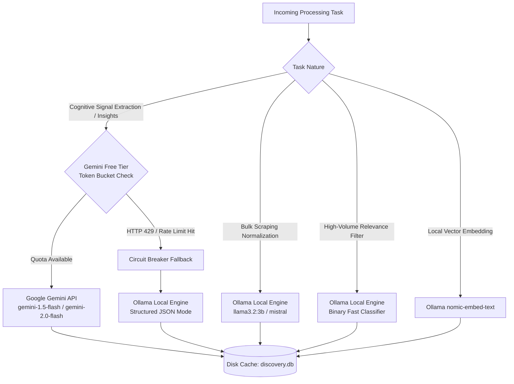
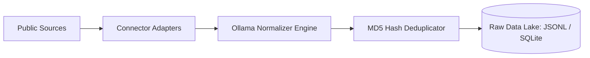
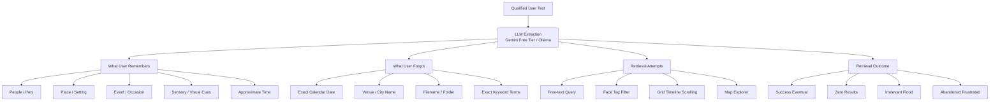
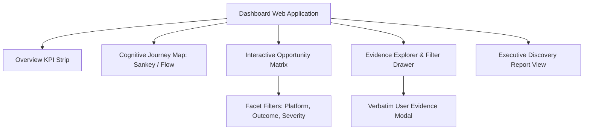
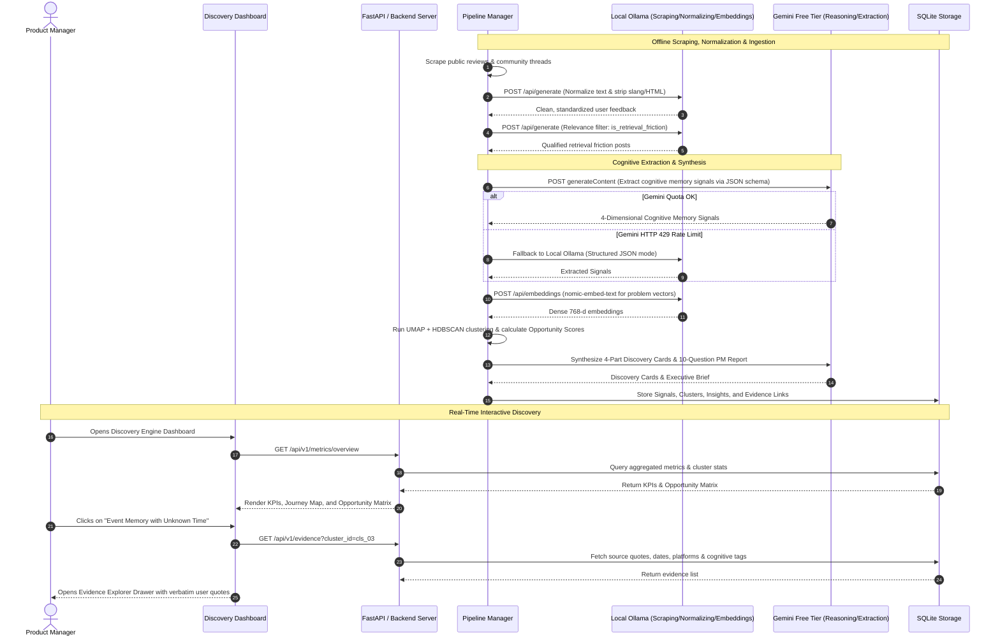

# AI-Powered Photo Retrieval Discovery Engine — Google Photos Use Case
## System Architecture & Technical Design Document (`architecture.md`)

---

## 1. Architectural Blueprint & System Overview

The **AI-Powered Photo Retrieval Discovery Engine** is an asynchronous, evidence-traceable intelligence platform. It converts noisy, unstructured consumer discussions from app stores, forums, and social communities into structured cognitive models of human memory failures, prioritized product opportunity areas, and interactive discovery artifacts for Product Managers.

To ensure high analytical depth while operating strictly within free, sustainable infrastructure, the system utilizes a **Hybrid Dual-LLM Architecture**:
1. **Local Ollama (Local Engine):** Handles high-volume, zero-cost tasks including scraping data cleaning, syntax normalization, fast heuristic relevance gating, and local vector embeddings without rate-limit constraints.
2. **Google Gemini Free Tier (Cloud Reasoning Engine):** Handles nuanced cognitive memory signal extraction, complex root-cause taxonomy generation, and executive product insight synthesis with strict rate-limit management and automatic local fallback to Ollama.

```
┌─────────────────────────────────────────────────────────────────────────────────────────────┐
│                                    DATA INGESTION SOURCES                                   │
│  [Google Play Store]  [Apple App Store]  [Reddit (r/googlephotos)]  [Google Help Community] │
└──────────────────────────────────────────────┬──────────────────────────────────────────────┘
                                               │ (Raw Scraped JSON / Text)
                                               ▼
┌─────────────────────────────────────────────────────────────────────────────────────────────┐
│                      STAGE 1: SCRAPING & NORMALIZATION (LOCAL OLLAMA)                       │
│  - Text Deserialization & Normalization      - Slang / Noise Stripping (Ollama)             │
│  - MD5 Content Deduplication Cache           - Unified Schema Formatting                    │
└──────────────────────────────────────────────┬──────────────────────────────────────────────┘
                                               │ Normalized Clean Ingestion Data
                                               ▼
┌─────────────────────────────────────────────────────────────────────────────────────────────┐
│                   STAGE 2: RELEVANCE & FRICTION GATE (LOCAL OLLAMA FILTER)                  │
│  - Fast Regex / Heuristic Keywords Filter    - Zero-Shot Intent Gate (Ollama Llama 3.2)     │
│  - Strips Billing / Storage Noise            - Filters 10,000+ posts -> Retrieval Friction  │
└──────────────────────────────────────────────┬──────────────────────────────────────────────┘
                                               │ Qualified Retrieval Friction Records
                                               ▼
┌─────────────────────────────────────────────────────────────────────────────────────────────┐
│              STAGE 3: COGNITIVE MEMORY & SIGNAL EXTRACTION (GEMINI FREE TIER)               │
│  * Primary: Google Gemini Free Tier (Structured JSON Schema via Gemini 1.5/2.0 Flash)       │
│  * Resilience Fallback: Local Ollama (Structured JSON mode upon HTTP 429 rate limit)        │
│  - What User Remembers (Entities/Cues)       - What User Forgot (Dates/Venues/Filenames)    │
│  - Retrieval Action Paths (Search/Scroll)    - Terminal Failure Mode (Zero-hit/Abandon)     │
└──────────────────────────────────────────────┬──────────────────────────────────────────────┘
                                               │ Structured JSON Signals
                                               ▼
┌─────────────────────────────────────────────────────────────────────────────────────────────┐
│               STAGE 4 & 5: LOCAL EMBEDDINGS & SEMANTIC CLUSTERING (OLLAMA)                  │
│  - Dense Vector Embeddings (Ollama nomic-embed-text / all-minilm)                           │
│  - UMAP Dimensionality Reduction & HDBSCAN Density Clustering                               │
│  - Dynamic Cluster Naming & Taxonomy Synthesis (Gemini Free Tier / Ollama)                  │
└──────────────────────────────────────────────┬──────────────────────────────────────────────┘
                                               │ Normalized Problem Clusters
                                               ▼
┌─────────────────────────────────────────────────────────────────────────────────────────────┐
│               STAGE 6 & 7: OPPORTUNITY SCORING & INSIGHT SYNTHESIS (GEMINI)                 │
│  - Multi-Criteria Opportunity Algorithm     - 4-Part Discovery Cards (Gemini Free Tier)     │
│  - Immutable Audit Pointers to Verbatim Source Rows (Zero-Hallucination Graph)              │
└──────────────────────────────────────────────┬──────────────────────────────────────────────┘
                                               │ Indexed Discovery Graph
                                               ▼
┌─────────────────────────────────────────────────────────────────────────────────────────────┐
│                        STAGE 8 & 9: INTERACTIVE DISCOVERY DASHBOARD                         │
│  - Executive KPI Strip         - Cognitive Retrieval Map (Sankey / Journey Flow)            │
│  - Opportunity Matrix Grid     - Evidence Explorer (Verbatim quotes & facet filters)        │
│  - 10-Question Product Discovery Report Synthesis                                           │
└─────────────────────────────────────────────────────────────────────────────────────────────┘
```

---

## 2. Hybrid LLM Architecture: Gemini Free Tier + Local Ollama

### 2.1 Strategic Division of Responsibilities

| Pipeline Stage | Primary LLM Engine | Model Recommendation | Execution Mode | Rationale |
| :--- | :--- | :--- | :--- | :--- |
| **Scraping Text Normalization** | **Local Ollama** | `llama3.2:3b` / `mistral:7b` | Local Batch (CLI/API) | Free, unlimited throughput; handles noisy scraped text, strips markdown/HTML, normalizes forum slang without burning cloud quotas. |
| **Relevance Filtering Gate** | **Local Ollama** | `llama3.2:3b` / `qwen2.5:3b` | Local Stream | Classifies high-volume posts (thousands per batch) into retrieval vs. non-retrieval (billing, sync, etc.) without exhausting API quotas. |
| **Cognitive Memory Signal Extraction** | **Gemini Free Tier** *(Fallback: Ollama)* | `gemini-1.5-flash` / `gemini-2.0-flash` | Cloud API (Structured JSON) | Superior cognitive reasoning; extracts subtle episodic recall cues (spatial, temporal, aesthetic) into strict Pydantic schemas. |
| **Vector Embeddings** | **Local Ollama** | `nomic-embed-text` / `all-minilm` | Local Vector API | Zero cloud latency and no token charges for embedding normalized problem summaries. |
| **Cluster Naming & Taxonomy** | **Gemini Free Tier** *(Fallback: Ollama)* | `gemini-1.5-flash` | Cloud API | Synthesizes emergent problem titles and separates root causes from symptoms across cluster centroids. |
| **Discovery Insight Cards & PM Synthesis** | **Gemini Free Tier** | `gemini-1.5-flash` | Cloud API | High-order product reasoning translating clusters into actionable product opportunities and the 10-question PM report. |

### 2.2 Rate-Limit & Resilience Handler (`LLMOrchestrator`)
The free tier of Google Gemini offers up to 15 Requests Per Minute (RPM) and 1,500 Requests Per Day (RPD). To ensure high performance without interruption, the architecture includes an **LLM Orchestrator** with:
* **Token-Bucket Rate Limiter:** Throttles Gemini API calls to 14 RPM max with exponential backoff on HTTP 429.
* **Automatic Fallback Circuit Breaker:** If Gemini returns a rate-limit error (`RESOURCE_EXHAUSTED` / `429`) or network interruption, the request is transparently routed to local **Ollama** (`http://localhost:11434/api/generate`) with a structured JSON prompt format.
* **Batch Caching:** Every LLM response is cached by an MD5 hash of `(model_name, prompt_version, input_text)` in `discovery.db`. Reprocessing the same reviews incurs **0 tokens** and runs at disk speed.



---

## 3. Core Architectural Principles

1. **Zero Cloud Infrastructure Cost:** Runs 100% on free-tier services (Gemini Free API) and local compute (Ollama on CPU/local GPU) without requiring paid cloud instances.
2. **Evidence-First Traceability (Anti-Hallucination):** Every metric, opportunity score, and generated product insight maintains a bidirectional pointer to the immutable primary source record (URL, author, timestamp, raw verbatim).
3. **Cognitive Dissection over Sentiment:** Traditional NLP classifies sentiment as positive/negative. This architecture decomposes episodic memory into cognitive components: *Episodic Anchors (Remembers)* vs. *Metadata Amnesia (Forgets)* vs. *Action Path* vs. *Terminal State*.
4. **Decoupled Pipeline Architecture:** Processing stages operate independently via defined schemas, enabling offline batch processing, caching, and deterministic re-runs without duplicate LLM inference calls.
5. **Data-Emergent Taxonomy:** Categories and clusters are derived dynamically through dense semantic vector similarity rather than rigid, static categorization.

---

## 4. End-to-End Component Specifications

### 4.1 Module 1: Ingestion, Scraping & Text Normalization
* **Purpose:** Collects public reviews and community discussions regarding Google Photos and standardizes messy text.
* **Source Adapters:**
  * `PlayStoreScraperAdapter`: Utilizes `google-play-scraper` to ingest 1-star to 4-star reviews containing search-related terms (`search`, `find`, `lost`, `look for`, `where`).
  * `AppStoreScraperAdapter`: Scrapes Apple App Store customer feedback via RSS/iTunes APIs.
  * `RedditAdapter`: Queries Pushshift / Reddit API for threads containing `"r/googlephotos"`, `"r/google"`, filtering by flair: `Help`, `Bug`, `Question`.
  * `GoogleHelpForumAdapter`: Ingests support queries tagged under "Search & organize photos".
* **Normalization Engine (Local Ollama):**
  * Strips emojis, broken unicode, web markup, and promotional noise.
  * Normalizes informal internet slang (e.g., *"idk where my pic went, searched cafe but nthng"* $\rightarrow$ *"User doesn't know where photo is located; searched 'cafe' but received zero results"*).
  * Computes an MD5 signature of normalized text + author name + timestamp to discard duplicates.



### 4.2 Module 2: Cleaning & Relevance Filter
* **Layer 1: Fast Heuristic Gate (Sub-millisecond):**
  * Discards non-retrieval topics (e.g., storage pricing tiers, Google One subscriptions, print book shipping, phone battery drain).
* **Layer 2: Local Ollama Relevance Gate (Zero-Cost Batch):**
  * Runs a zero-shot classification prompt through local Ollama (`llama3.2:3b`).
  * Classifies if the text describes a user seeking a photo with incomplete metadata or experiencing retrieval difficulty.

```python
class RelevanceGateOutput(BaseModel):
    is_retrieval_friction: bool
    confidence_score: float
    relevance_rationale: str
    friction_trigger: Optional[str]  # e.g., "lost screenshot", "forgot date", "failed query"
```

### 4.3 Module 3: Cognitive Memory & Signal Extraction Engine
Transforms qualified natural language complaints into a 4-dimensional cognitive model via structured LLM extraction.
* **Primary Engine:** Google Gemini Free Tier (`gemini-1.5-flash` or `gemini-2.0-flash`) using `response_mime_type="application/json"` and Pydantic validation.
* **Fallback Engine:** Local Ollama running in JSON mode if Gemini free tier RPM limits are exceeded.



#### Structured Pydantic Extraction Schema:
```python
from pydantic import BaseModel, Field
from typing import List, Optional
from enum import Enum

class OutcomeEnum(str, Enum):
    SUCCESS_INSTANT = "SUCCESS_INSTANT"
    SUCCESS_EVENTUAL = "SUCCESS_EVENTUAL"
    FAILED_ZERO_RESULTS = "FAILED_ZERO_RESULTS"
    FAILED_IRRELEVANT = "FAILED_IRRELEVANT"
    ABANDONED = "ABANDONED"
    EXTERNAL_WORKAROUND = "EXTERNAL_WORKAROUND"

class MemorySignals(BaseModel):
    entities_remembered: List[str] = Field(description="People, pets, objects recalled")
    spatial_cues: Optional[str] = Field(description="Visual setting, café, beach, indoor room")
    temporal_cues: Optional[str] = Field(description="Relative time, e.g. 'last summer', 'college'")
    visual_aesthetic_cues: Optional[str] = Field(description="Colors, lighting, framing, objects")
    embedded_text_cues: Optional[str] = Field(description="OCR text user remembers on the image")

class ForgottenSignals(BaseModel):
    exact_date_forgotten: bool = True
    exact_location_forgotten: bool = False
    filename_forgotten: bool = True
    album_name_forgotten: bool = False

class RetrievalAction(BaseModel):
    action_type: str = Field(description="text_query, face_tag, manual_scroll, map_filter")
    query_string: Optional[str] = None

class CognitiveExtractionPayload(BaseModel):
    conversation_id: str
    memory_signals: MemorySignals
    forgotten_signals: ForgottenSignals
    actions_taken: List[RetrievalAction]
    outcome: OutcomeEnum
    user_frustration_level: int = Field(ge=1, le=5, description="1=Mild, 5=Extreme rage/churn")
    primary_failure_mode: str
```

### 4.4 Module 4: Local Embedding & Semantic Clustering
Rather than predefining fixed labels, the engine surfaces clusters dynamically:
1. **Local Vector Embedding (Ollama):** Passes normalized problem summaries through Ollama's `nomic-embed-text` (or `all-minilm`) to create dense 768-dimensional embeddings locally at zero cost.
2. **Dimensionality Reduction (UMAP):** Projects embeddings to a low-dimensional manifold preserving local and global semantic structures.
3. **Density Clustering (HDBSCAN):** Groups points into dense problem neighborhoods without forcing outliers into arbitrary clusters.
4. **Cluster Naming & Archetype Synthesizer (Gemini Free Tier):** Evaluates representative user quotes for each cluster to formulate:
   * **Standardized Name:** e.g., *"Event Memory with Location Amnesia"*
   * **Core Problem Archetype:** e.g., *"Visual-Concept Search Gap"*
   * **Root Cause vs. Symptom:** Root Cause = *"Metadata Dependency"*, Symptom = *"4-hour Manual Grid Scroll"*.

### 4.5 Module 5: Opportunity Scoring & Matrix Generator
Computes algorithmic priority signals for each cluster based on real user data:

$$\text{Opportunity Score} = \left( \frac{V}{V_{\max}} \times 0.35 \right) + \left( R_{\text{fail}} \times 0.30 \right) + \left( \frac{\bar{S}}{5.0} \times 0.20 \right) + \left( \frac{P_{\text{cross}}}{P_{\text{total}}} \times 0.15 \right)$$

Where:
* $V$: Total supporting conversations for the problem cluster.
* $V_{\max}$: Maximum volume among all clusters.
* $R_{\text{fail}}$: Retrieval failure rate ($\frac{\text{Abandoned} + \text{Failed}}{\text{Total Attempts}}$).
* $\bar{S}$: Average user frustration severity ($1.0 - 5.0$).
* $P_{\text{cross}}$: Number of distinct platforms where the problem was documented.
* $P_{\text{total}}$: Total number of ingested platforms.

#### Priority Tiers:
* **Score $\ge 0.75$:** Critical / P0 Opportunity Area
* **$0.55 \le$ Score $< 0.75$:** High / P1 Opportunity Area
* **$0.40 \le$ Score $< 0.55$:** Medium / P2 Opportunity Area
* **Score $< 0.40$:** Low / P3 Backlog Opportunity Area

### 4.6 Module 6: Traceability & Evidence Graph
Maintains referential integrity between high-level insights and raw data:
* Each generated insight has a foreign key to its cluster ID.
* Each cluster maintains an index of original `conversation_id`s.
* When a PM clicks any cell in the Opportunity Matrix, the system queries the Evidence Store and renders the verified user verbatims, platform origin, date, and extracted cognitive tags.

### 4.7 Module 7: Discovery Insight Synthesis (Gemini Free Tier)
Generates structured discovery cards according to the 4-part product framework:

```
┌────────────────────────────────────────────────────────────────────────┐
│                        PRODUCT DISCOVERY CARD                          │
├────────────────────────────────────────────────────────────────────────┤
│ [1] USER MEMORY PATTERN                                                │
│     Users recall contextual ambiance, social setting, and companions   │
│     far more readily than specific dates or formal venue titles.       │
├────────────────────────────────────────────────────────────────────────┤
│ [2] RETRIEVAL PATTERN                                                  │
│     Users issue compound natural queries such as "café with Sarah in   │
│     Goa" hoping the system joins people + setting + fuzzy location.   │
├────────────────────────────────────────────────────────────────────────┤
│ [3] FAILURE PATTERN                                                    │
│     Search engine treats terms as disjoint metadata tokens, requiring  │
│     strict EXIF location tags or OCR hits, failing to resolve context. │
├────────────────────────────────────────────────────────────────────────┤
│ [4] PRODUCT OPPORTUNITY                                                │
│     Relational Context Search: Multi-modal fusion uniting face tags,   │
│     scene semantics, and seasonal trip boundaries into one query.      │
├────────────────────────────────────────────────────────────────────────┤
│ EVIDENCE: 428 Verified Conversations | 81% Failure Rate | Score: 0.88 │
└────────────────────────────────────────────────────────────────────────┘
```

---

## 5. Interactive Dashboard Architecture

The visual discovery dashboard gives Product Managers, Designers, and Engineers deep explorability into user problems.



### Dashboard Visual Components:
1. **Executive Metrics Strip:**
   * Total Analyzed Reviews
   * Qualified Retrieval Friction Threads
   * Average System Retrieval Failure Rate
   * Top Unaddressed Cognitive Friction Cluster
2. **Cognitive Retrieval Journey Flow:**
   * Interactive multi-step visual flow:
     $$\text{Memory Anchor} \longrightarrow \text{Search Action} \longrightarrow \text{Failure Mode} \longrightarrow \text{Opportunity}$$
3. **Opportunity Prioritization Matrix:**
   * Dynamic scatter plot & sortable table ($X$-axis: Retrieval Failure Rate, $Y$-axis: Evidence Volume, Bubble Size: Frustration Severity).
4. **Evidence Explorer Drawer:**
   * Clickable problem categories displaying verbatim quotes, source badges (Play Store, Reddit, Apple Store), and extracted memory clues.
5. **Final 10-Question Discovery Synthesis:**
   * Pre-compiled executive brief addressing the 10 core discovery questions with direct links to supporting evidence.

---

## 6. Data Flow & Sequence Architecture



---

## 7. Database Schema Specification (`discovery.db`)

```sql
-- Raw user conversations from public sources
CREATE TABLE raw_conversations (
    id VARCHAR(64) PRIMARY KEY,
    source VARCHAR(32) NOT NULL, -- 'play_store', 'app_store', 'reddit', 'help_forum'
    source_url TEXT,
    post_date TIMESTAMP NOT NULL,
    platform VARCHAR(16) NOT NULL, -- 'android', 'ios', 'web'
    author_pseudonym VARCHAR(64),
    raw_text TEXT NOT NULL,
    normalized_text TEXT,          -- Produced by Ollama normalization
    star_rating INTEGER,
    engagement_count INTEGER DEFAULT 0,
    created_at TIMESTAMP DEFAULT CURRENT_TIMESTAMP
);

-- Relevance qualification output (Ollama)
CREATE TABLE conversation_qualifications (
    conversation_id VARCHAR(64) PRIMARY KEY REFERENCES raw_conversations(id),
    is_retrieval_friction BOOLEAN NOT NULL,
    confidence_score FLOAT NOT NULL,
    filter_reason TEXT,
    qualified_by VARCHAR(32) DEFAULT 'ollama_llama3.2',
    qualified_at TIMESTAMP DEFAULT CURRENT_TIMESTAMP
);

-- Extracted cognitive memory and retrieval signals (Gemini / Ollama Fallback)
CREATE TABLE extracted_signals (
    id VARCHAR(64) PRIMARY KEY,
    conversation_id VARCHAR(64) REFERENCES raw_conversations(id),
    entities_remembered TEXT,       -- JSON array of entities
    spatial_cues TEXT,              -- Visual/spatial memory
    temporal_cues TEXT,             -- Vague/relative temporal memory
    visual_cues TEXT,               -- Visual traits/aesthetic memory
    text_cues TEXT,                 -- Embedded OCR text recalled
    date_forgotten BOOLEAN DEFAULT TRUE,
    location_forgotten BOOLEAN DEFAULT FALSE,
    filename_forgotten BOOLEAN DEFAULT TRUE,
    actions_taken TEXT,             -- JSON array of attempts
    terminal_outcome VARCHAR(32) NOT NULL,
    frustration_severity INTEGER CHECK(frustration_severity BETWEEN 1 AND 5),
    primary_failure_mode TEXT NOT NULL,
    extracted_by VARCHAR(32) DEFAULT 'gemini-1.5-flash'
);

-- Dynamically emergent problem clusters
CREATE TABLE problem_clusters (
    id VARCHAR(64) PRIMARY KEY,
    cluster_name VARCHAR(128) NOT NULL,
    archetype VARCHAR(64) NOT NULL,
    root_cause TEXT NOT NULL,
    symptom_description TEXT NOT NULL,
    evidence_count INTEGER NOT NULL,
    unique_users_count INTEGER NOT NULL,
    failure_rate FLOAT NOT NULL,
    average_severity FLOAT NOT NULL,
    opportunity_score FLOAT NOT NULL,
    opportunity_tier VARCHAR(16) NOT NULL -- 'CRITICAL', 'HIGH', 'MEDIUM', 'LOW'
);

-- Mapping table linking extracted signals to problem clusters
CREATE TABLE signal_cluster_mapping (
    signal_id VARCHAR(64) REFERENCES extracted_signals(id),
    cluster_id VARCHAR(64) REFERENCES problem_clusters(id),
    distance_to_centroid FLOAT,
    PRIMARY KEY (signal_id, cluster_id)
);

-- Synthesized Product Discovery Cards
CREATE TABLE product_insights (
    id VARCHAR(64) PRIMARY KEY,
    cluster_id VARCHAR(64) REFERENCES problem_clusters(id),
    user_memory_pattern TEXT NOT NULL,
    retrieval_pattern TEXT NOT NULL,
    failure_pattern TEXT NOT NULL,
    opportunity_statement TEXT NOT NULL,
    recommended_feature_direction TEXT NOT NULL
);

-- Model invocation cache for zero-waste repeatability
CREATE TABLE llm_cache (
    cache_key VARCHAR(64) PRIMARY KEY, -- MD5 of (model, prompt, input)
    model_name VARCHAR(64) NOT NULL,
    response_json TEXT NOT NULL,
    created_at TIMESTAMP DEFAULT CURRENT_TIMESTAMP
);
```

---

## 8. REST API Endpoints Specification

| Method | Endpoint | Description | Query Parameters |
| :--- | :--- | :--- | :--- |
| `GET` | `/api/v1/metrics/overview` | Returns global KPIs (total parsed, friction rate, breakdown by platform) | `time_range`, `platform` |
| `GET` | `/api/v1/problems` | List of all discovered problem clusters with scores and metrics | `sort_by`, `tier`, `min_volume` |
| `GET` | `/api/v1/problems/{cluster_id}` | Detailed breakdown of a single cluster including synthesized insight card | `cluster_id` |
| `GET` | `/api/v1/problems/{cluster_id}/evidence` | Returns paginated raw verbatim quotes, memory tags, and metadata | `page`, `page_size`, `platform` |
| `GET` | `/api/v1/journey/graph` | Returns the flow graph data (Memory Cue $\rightarrow$ Attempt $\rightarrow$ Failure $\rightarrow$ Opportunity) | `threshold` |
| `GET` | `/api/v1/report/discovery-brief` | Returns the synthesized 10-Question Product Discovery Report in JSON/Markdown | `format` |

---

## 9. Technology Stack & Implementation Framework

* **Core Pipeline & Backend:** Python 3.11+
  * *API Server:* `FastAPI` + `uvicorn` (asynchronous, OpenAPI auto-documentation)
  * *Data & Schema Enforcement:* `pydantic` v2, `pandas`, `sqlite3`
  * *Clustering & Embeddings:* `scikit-learn`, `umap-learn`, `hdbscan`, `numpy`
* **LLM & Inference Infrastructure:**
  * **Google Gemini Free Tier:** `google-genai` SDK (`gemini-1.5-flash` / `gemini-2.0-flash`) for structured reasoning and synthesis.
  * **Local Ollama:** `ollama-python` / REST client connecting to `http://localhost:11434` for text normalization, relevance gating, local embeddings (`nomic-embed-text`), and rate-limit fallback.
  * **Rate-Limit & Circuit Breaker Manager:** In-house Token Bucket throttler (14 RPM cap) with automatic local Ollama failover.
* **Frontend Discovery Dashboard:**
  * Modern Responsive Web App (HTML5 / Vanilla CSS / Modern ES6+) with zero build step dependencies or React/Vite.
  * Visualizations: SVG Flow Journey Graphs, Chart.js, sortable data tables, and modal evidence drawers.
* **Privacy & Security:**
  * Client data anonymization (strips emails, phone numbers, and author handles prior to processing).
  * Local disk caching ensures zero re-computation costs.

---

## 10. Verification & Validation Framework

1. **Schema Validation:** Unit tests ensure 100% of pipeline outputs adhere to Pydantic models.
2. **Dual-LLM Failover Test:** Automated test simulating Gemini HTTP 429 to confirm seamless, transparent fallback to local Ollama.
3. **Audit Verification:** Automated check ensures every insight record maps to $\ge 5$ distinct, valid `raw_conversations` rows.
4. **Reproducibility Test:** Verifies that running clustering with identical random seeds produces matching clusters and opportunity rankings.
5. **End-to-End Traceability Test:** Given an Opportunity Area ID, assert that the system can resolve back to the exact URL, author, and verbatim review text in $< 50$ ms.
