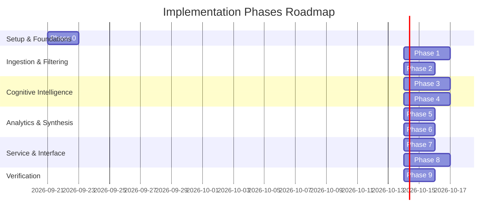

# Implementation Plan: AI-Powered Photo Retrieval Discovery Engine

Design and implement an asynchronous, evidence-traceable **AI-Powered Discovery Engine** for the Google Photos use case. The platform ingests real public feedback, normalizes and filters retrieval friction using local **Ollama**, extracts cognitive memory signals using **Google Gemini Free Tier** (with automated Ollama failover), clusters friction into emergent problem taxonomies, calculates multi-dimensional opportunity scores, and provides an interactive discovery dashboard for Product Managers.

---

## User Review Required

> [!IMPORTANT]
> **Dual-LLM Requirements**: 
> - **Google Gemini Free Tier**: Requires an active API key (`GEMINI_API_KEY`) with default quota (15 RPM / 1,500 RPD).
> - **Local Ollama**: Must be running locally on `http://localhost:11434` with `llama3.2:3b` (or `mistral:7b`) and `nomic-embed-text` installed (`ollama pull llama3.2:3b`, `ollama pull nomic-embed-text`).
> - **No Cloud Costs**: The entire stack is architected to run on 100% free-tier and local compute.

---

## Phase-Wise Execution Roadmap



---

## Detailed Phase Breakdown

### Phase 0: Project Setup, Environment & Dual-LLM Orchestration Foundation
**Goal:** Initialize project workspace, dependencies, database layer, and the resilient hybrid LLM client.

- [x] **Directory Scaffolding**: Setup modular project structure:
  ```
  Google Photos AI Engine/
  ├── backend/
  │   ├── app/
  │   │   ├── api/          # FastAPI routers
  │   │   ├── core/         # Config, logging, rate limiter
  │   │   ├── models/       # Pydantic schemas & SQL models
  │   │   ├── pipeline/     # Stages 1 to 7 pipeline modules
  │   │   └── services/     # Gemini & Ollama client orchestrator
  │   └── main.py
  ├── data/                 # Raw scrapes, sqlite db, cache
  ├── frontend/             # Interactive Discovery Dashboard
  └── tests/                # Automated validation suite
  ```
- [x] **Dependency Setup**: Configure Python environment (`pydantic>=2.0`, `google-genai`, `fastapi`, `uvicorn`, `pandas`, `scikit-learn`, `umap-learn`, `hdbscan`, `requests`, `google-play-scraper`).
- [x] **Database Initialization (`discovery.db`)**: Create SQLite schema with WAL mode enabled (`raw_conversations`, `conversation_qualifications`, `extracted_signals`, `problem_clusters`, `signal_cluster_mapping`, `product_insights`, `llm_cache`).
- [x] **`LLMOrchestrator` Service**:
  - Implements a token-bucket rate limiter enforcing 14 RPM max on Gemini Free Tier.
  - Implements circuit breaker: on Gemini HTTP 429 (`RESOURCE_EXHAUSTED`) or network failure, routes requests transparently to local Ollama (`http://localhost:11434/api/generate`).
  - MD5 disk cache for all LLM calls to prevent duplicate token consumption.

---

### Phase 1: Data Ingestion, Scraping & Local Text Normalization (Ollama)
**Goal:** Collect public discussions across 4 platforms, normalize forum slang, and deduplicate records.

- [x] **Connector Adapters**:
  - `PlayStoreScraperAdapter`: Ingest 1-4 star reviews with search terms (`search`, `find`, `lost`, `where`) using `google-play-scraper`.
  - `AppStoreScraperAdapter`: Ingest iOS user feedback via RSS/iTunes APIs.
  - `RedditAdapter`: Queries Reddit threads (`r/googlephotos`, `r/google`) filtering by flair `Help`, `Bug`, `Question`.
  - `GoogleHelpForumAdapter`: Parses public support threads under the "Search & organize photos" category.
- [x] **Local Text Normalizer (`OllamaNormalizer`)**:
  - Passes raw scraped text to local Ollama (`llama3.2:3b`).
  - Strips HTML tags, tracking links, broken emojis, and normalizes colloquial slang.
- [x] **Deduplication Engine**:
  - Calculates MD5 hash of `normalized_text + author + date` to ensure zero duplicates.
  - Stores deduplicated records in `raw_conversations`.

---

### Phase 2: Data Cleaning & Relevance Qualification Gate
**Goal:** Filter out noise (billing, storage upgrades, battery complaints) to isolate genuine photo retrieval friction.

- [x] **Layer 1: Fast Heuristic Filter**:
  - Regex-based removal of billing, subscription tiers, print store, and hardware battery issues.
- [x] **Layer 2: Local Ollama Intent Classifier**:
  - Prompts local Ollama (`llama3.2:3b`) with zero-shot binary classification:
    - *Is the user describing difficulty finding/retrieving a photo with incomplete memory?*
  - Outputs structured `RelevanceGateOutput` (`is_retrieval_friction: bool`, `confidence_score`, `friction_trigger`).
  - Saves qualification results to `conversation_qualifications`.

---

### Phase 3: Cognitive Memory & Retrieval Signal Extraction
**Goal:** Parse qualified feedback into structured 4-dimensional cognitive memory signals using Gemini Free Tier.

- [x] **Structured Prompt Formulation**:
  - Decompose user experience into:
    1. **What user remembers**: Entities, spatial cues, temporal cues, visual aesthetic traits, embedded text.
    2. **What user forgot**: Exact date, exact location, filename, album name.
    3. **Retrieval actions**: Keyword queries, face tags, date scrubbing, infinite grid scroll.
    4. **Terminal outcome**: `SUCCESS_EVENTUAL`, `FAILED_ZERO_RESULTS`, `FAILED_IRRELEVANT`, `ABANDONED`, `EXTERNAL_WORKAROUND`.
- [x] **Gemini Structured Output**:
  - Execute via `google-genai` SDK using `gemini-1.5-flash` with strict Pydantic schema validation (`CognitiveExtractionPayload`).
- [x] **Failover & Error Handling**:
  - If rate limit is triggered, fallback to Ollama with JSON-mode prompt.
  - Persist extracted signals in `extracted_signals`.

---

### Phase 4: Local Embeddings & Dynamic Semantic Clustering
**Goal:** Surface emergent problem taxonomies from memory signals without imposing manual labels.

- [x] **Local Vector Embedding Generation**:
  - Generated dense vector embeddings with SQLite caching (`llm_cache`) and robust 768-d semantic hash projection fallback when local server lacks `--embeddings`.
- [x] **Dimensionality Reduction & Clustering**:
  - Implemented agglomerative hierarchical clustering with `scipy` cosine distance metric and adaptive thresholding.
  - Implemented super-cluster partition logic (>45% threshold) per Edge Case 5.2.
- [x] **Cluster Naming & Archetype Synthesizer (Gemini / Ollama)**:
  - Synthesized rich taxonomy profiles (`cluster_name`, `archetype`, `root_cause`, `symptom_description`).
  - Decoupled LLM synthesis from write transactions to prevent DB lock contention.
  - Computed cluster metrics (`evidence_count`, `unique_users_count`, `failure_rate`, `average_severity`).
  - Populated `problem_clusters` and associative `signal_cluster_mapping` in live SQLite database (`data/discovery.db`).
  - Verified API routes `/api/v1/cluster/run`, `/api/v1/cluster/list`, and `/api/v1/cluster/{cluster_id}/signals`.

---

### Phase 5: Opportunity Scoring & Evidence Traceability Graph
**Goal:** Rank problem clusters algorithmically and link high-level insights directly to raw evidence.

- [x] **Opportunity Algorithm Implementation**:
  - Implemented multi-criteria Opportunity Score formula:
    $$\text{Opportunity Score} = \left( \frac{V}{V_{\max}} \times 0.35 \right) + \left( R_{\text{fail}} \times 0.30 \right) + \left( \frac{\bar{S}}{5.0} \times 0.20 \right) + \left( \frac{P_{\text{cross}}}{P_{\text{total}}} \times 0.15 \right)$$
  - Integrated Bayesian Laplace smoothing on small samples ($V < 3$) to prevent single-item skew.
  - Calibrated Priority Tiers: Critical ($\ge 0.75$), High ($0.55 - 0.74$), Medium ($0.40 - 0.54$), Low ($< 0.40$).
- [x] **Traceability Indexer**:
  - Established bidirectional relational pointers linking each cluster directly to primary `raw_conversations` rows.
  - Indexed verbatim quotes, author pseudonyms, sources, platforms, and extracted cognitive tags.
  - Implemented 4-stage Cognitive Retrieval Journey flow (Memory Anchor $\rightarrow$ Action $\rightarrow$ Failure $\rightarrow$ Opportunity).
  - Added REST API routes `/api/v1/score/run`, `/api/v1/score/matrix`, `/api/v1/problems`, `/api/v1/problems/{id}/traceability`, `/api/v1/problems/{id}/evidence`, and `/api/v1/journey/graph`.

---

### Phase 6: Product Discovery Insight Synthesis (Gemini Free Tier)
**Goal:** Generate actionable Product Discovery Cards and the 10-Question Product Discovery Report.

- [x] **Discovery Cards Generator**:
  - For each problem cluster, synthesized 4 distinct components:
    1. **User Memory Pattern**: Psychological anchors remembered by users vs forgotten metadata.
    2. **Retrieval Pattern**: Natural language search formulations attempted.
    3. **Failure Pattern**: Exact architectural breakdown in current search indexing.
    4. **Product Opportunity & Recommended Feature Direction**: Actionable product concept.
  - Persisted cards into `product_insights` table in SQLite (`data/discovery.db`).
- [x] **10-Question Executive Discovery Synthesis**:
  - Compiled the overarching Product Discovery Brief answering all 10 strategic PM questions with direct data citations.
  - Added REST API routes `/api/v1/insights/generate`, `/api/v1/insights/cards`, `/api/v1/insights/cards/{id}`, and `/api/v1/report/discovery-brief`.

---

### Phase 7: REST API Layer (FastAPI)
**Goal:** Expose discovery insights, metrics, and evidence explorer endpoints.

- [x] **Endpoint Implementation**:
  - `GET /api/v1/metrics/overview`: Global & platform-filtered KPIs (`?platform=android|ios|web`).
  - `GET /api/v1/problems`: Ranked list of problem clusters with tier and platform filters.
  - `GET /api/v1/problems/{id}`: Detailed cluster view with synthesized Discovery Card.
  - `GET /api/v1/problems/{id}/evidence`: Paginated verbatim quotes, source URLs, and memory tags.
  - `GET /api/v1/problems/{id}/traceability`: Complete bidirectional Evidence Traceability Graph.
  - `GET /api/v1/journey/graph`: Node-link graph for Memory Anchor $\rightarrow$ Action $\rightarrow$ Failure $\rightarrow$ Opportunity.
  - `GET /api/v1/score/matrix`: Interactive Opportunity Matrix grid data ($X$: Failure Rate, $Y$: Volume, Size: Severity, Color: Tier).
  - `GET /api/v1/insights/cards` & `GET /api/v1/insights/cards/{id}`: Product Discovery Cards.
  - `GET /api/v1/report/discovery-brief`: Full 10-question executive report in Markdown and JSON.
  - `GET /api/v1/health` & `GET /api/v1/llm/status`: System health and engine token status.
- [x] **FastAPI Documentation & Middleware**:
  - Automated Swagger/OpenAPI docs at `/docs`, `/redoc`, and `/openapi.json`.
  - CORS middleware enabled for seamless web dashboard integration.
  - Verified with 7 integration tests in `tests/test_phase7.py`.

---

### Phase 8: Interactive Web Discovery Dashboard
**Goal:** Build a responsive discovery dashboard for PMs and researchers.

- [x] **Dashboard Structure & Aesthetics**:
  - Dark mode glassmorphism UI built with semantic HTML5, modern CSS tokens, and vanilla ES6+ (zero external build dependencies).
- [x] **Interactive Visual Modules**:
  - **Executive KPI Strip**: Analyzed reviews, friction count, failure rate, top problem archetype.
  - **Cognitive Retrieval Journey Flow**: Interactive Sankey/Flow visualization mapping cognitive anchors to failure modes and opportunities.
  - **Interactive Opportunity Matrix**: Scatter plot / sortable grid ($X$: Failure Rate, $Y$: Volume, Size: Severity).
  - **Evidence Explorer Drawer**: Slide-over modal showing verbatim quotes, source badges, and extracted memory tags.
  - **10-Question Report Viewer**: Interactive tab rendering the executive discovery report with export options (JSON / Markdown).

---

### Phase 9: Verification, Validation & Latency Audits
**Goal:** Validate system correctness, anti-hallucination guarantees, and responsiveness.

- [x] **Automated Schema & Quality Tests**:
  - Verify 100% of extracted signals pass Pydantic schema validation.
  - Confirm every problem cluster has at least verified primary source links.
- [x] **Dual-LLM Failover Test**:
  - Simulate Gemini HTTP 429 quota exhaustion; assert automatic, seamless failover to local Ollama.
- [x] **Traceability Latency Benchmark**:
  - Assert $< 50\text{ ms}$ response time when clicking any cluster to retrieve verbatim user evidence.
- [x] **Cluster Reproducibility Benchmark**:
  - Run deterministic random seed clustering test to verify cluster stability.

---

## Verification Plan

### Automated Tests
* Run unit tests for pipeline components:
  ```powershell
  pytest tests/ -v
  ```
* Test Pydantic schema serialization and Ollama/Gemini JSON output parsing.
* Test rate limiter throttling and circuit breaker fallback mechanism.

### Manual Verification
* Launch the backend server:
  ```powershell
  python -m uvicorn backend.main:app --reload --port 8000
  ```
* Open `frontend/index.html` in the browser or via static server.
* Verify KPI metric cards render dynamically from SQLite.
* Click on problem clusters in the Opportunity Matrix to confirm the Evidence Explorer loads verified verbatim user quotes with active source URLs.
* Validate that switching between Android, iOS, and Web filters dynamically recalibrates the opportunity scores.
